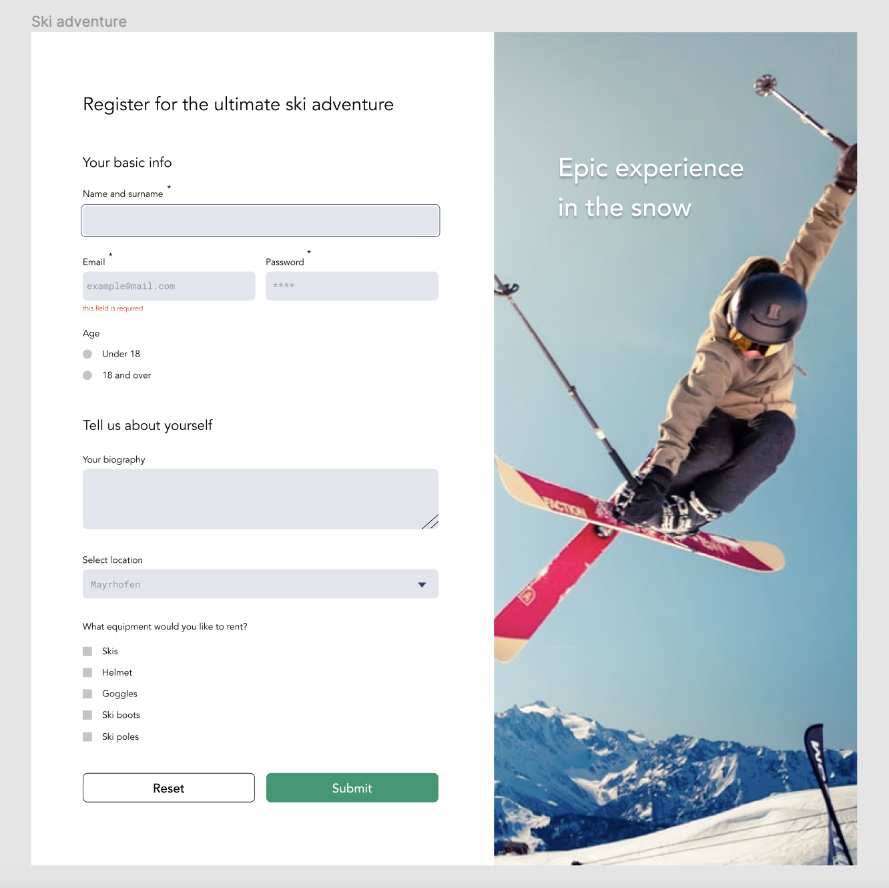

# The Ultimate Ski Adventure registration page

In this portfolio project, you'll build a registration page for the ultimate ski adventure.

## Mockups

[Link to Figma](https://www.figma.com/file/p12TxtRoy5rQth8S1WuUcY/Mimo-Dev-%C2%B7-Oct-'21-Cohort?node-id=189%3A24)

## Getting Started Notes

- Forms are an essential part of acquire users input. They offer controls for nearly every imaginable use of an application - registration, login, job application, etc.
  
- In this project we’ll practice how to use HTML to mark up a form, which elements to use to capture different types of data, and how to style forms with CSS. You don't need any JavaScript in this project.

**Pay close attention to**:
- Some fields are `required` to be filled in, in order to submit the registration.
- If the required field doesn't get filled in, the warning below the field warns the user - check `:valid` pseudo class.
- Reset button resets all the information in the form.
- You also need to style the `:focus` input border - see example in the `Name and surname` field. 

## Design tokens

We want to make sure that our site has a consistent look and feel, that's why we use _design tokens_.

**If you find it difficult to use these tokens, or if you're not able to achieve a result you're happy with, don't worry about it.** 

### Spacing

This landing page uses an 8px unit. This will help you to determine the size of padding and margin. Start with 16px and then adjust if you want more space (24px and up) or less (8px)

- `8px`
- `16px`
- `24px`
- `32px`
- `48px`
- `64px`
- `96px`
- `128px`

### Font

Font used in this mockup is `Nunito`. Select the font in [Google Fonts](https://fonts.google.com/) and include the link in the header of the HTML file.

The base font size is 16px, which reflect the typography in the following:

- `<h1>` - `40px`
- `<h2>` - `36px`
- `
` - `16px`

### Color palette

Primary (light blue):

- `#E2E5ED`

Secondary (green):

- `#149770`

> What the HEX Code?
>A color hex code is a hexadecimal way to represent a color in RGB format by combining three values – the amounts of red, green and blue in a particular shade of color.
> These color hex codes have been an integral part of HTML for web design, and remain a key way of representing color formats digitally.

## Submissions

**Portfolio Projects are built using the Replit platform.** 

If you would like to have your project reviewed, click on Submit button. You can still edit your project and it will be available for the reviewer to leave comments.
****